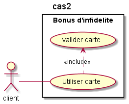

| | |
|-|-|
|No de Travail pratique|	Travail pratique 1|
|Étudiants|Wilfried NKOUEKAM MBOUGA, Nadine Manuela GOKAR (GOKN29569802),babacar diouf(DIOB07069709)	|
|Cours|	MGL7361|
|Session|S2021|
|Enseignant|Naima Essadi|
## Justification des choix de conception
| Type           | Nom de l'objet   | Responsabilités                                                                             | Dépendances            | Raison de dependance                                                                                                              | Raison choix Interface ou abstraction                                                                                             |
| -------------- | ---------------- | ------------------------------------------------------------------------------------------- | ---------------------- | --------------------------------------------------------------------------------------------------------------------------------- | --------------------------------------------------------------------------------------------------------------------------------- |
| Classe         | Client           | Identifier une personne qui désire acheter un produit                                       |                        |                                                                                                                                   |                                                                                                                                   |
| Classe         | CarteInfidelite  | Identifier une carte d'infidelité                                                           | Partenaire             | Identifier le nombre de partenaires ou la carte a été utilisé le mois précedent                                                   |                                                                                                                                   |
| Classe         | Abonne           | Identifier un client qui dispose d'une carte d'infidelite                                   | Client,CarteInfidelite | Identifier les informations clients ainsi que les informations de la carte d'infidelite détenues                                  |                                                                                                                                   |
| Classe         | Ville            | Identifier une ville et les zones associés                                                  | Zone                   | Identifier les zones de la ville                                                                                                  |                                                                                                                                   |
| Classe         | Zone             | Identifier une zone et les partenaires de la zone                                           | Partenaire             | Identifier les partenaires de la zone                                                                                             |                                                                                                                                   |
| Classe         | Partenaire       | Identifier un magagin ou un commerce ainsi que les produits qui y sont vendues              | AProduit               | Identifie les produits et cadeaux vendues ou offerte par le partenaire                                                            |                                                                                                                                   |
| Abstract class | AProduit         | identifier une abstraction d'un service offert par un partenaire                            |                        |                                                                                                                                   | Accéder facilement et de la même manière aux informations(descriptions,prix) d'un produit, d'un cadeau ou d'un catalogue cadeau   |
| Classe         | Produit          | identifier un service concret offert par un partenaire                                      | Aproduit,IStrategyCout | Avoir les mêmes caractéristique et méthodes que l'on retrouve dans AProduit, identifier la méthode utilisée pour calculer le prix |                                                                                                                                   |
| Classe         | CatalogueCadeau  | Identifier un ensemble de produit                                                           | AProduit               | Un Catalogue de cadeau est composé de Produit abstrait et est aussi un produit abstrait                                           |                                                                                                                                   |
| Classe         | Cadeau           | Identifier un produit dont la méthode de calcul de prix est différente du la méthode normal | Produit                | Un cadeau est un produit dont la stratégie de calcul de prix est différente de celle normale                                      |                                                                                                                                   |
| Interface      | IStrategyCout    | Identifier la strategie utilisée pour calcul le prix ou la reduction appliqué à un produit  |                        |                                                                                                                                   | Encapsuler à haut niveaux les variations possible qui pourrait avoir lieu lors du calcul de prix                                  |
| Classe         | DixPourCentCout | Effectuer une reduction de 10 pour cent sur le cout                                   | IStrategyCout          | correspond à une variante d'algorithme de calcul de cout de produit                                                |                                                                                                                                   |
| Classe         | CoutNormale  | Identifier qu'aucune reduction n'est appliquée au produit                                   | IStrategyCout          | variante par défaut pour le calcul du prix d'un produit                                                                           |                                                                                                                                   |
| Interface      | IStrategyPoint   | Identifier la strategie utilisée pour calcul le nombre de point appliqué à un produit       |                        |                                                                                                                                   | Encapsuler à haut niveaux les variations possible qui pourrait avoir lieu lors du calcul du nombre de points associe a un produit |
| Classe         | DixPourCentPoint  | Identifier que dix pour cent du cout du produit est considere comme nombre de point         | IStrategyPoint         | variante permettant de definir que dix pour cent du cout du produit est considere comme nombre de point                           |                                                                                                                                   |
## Diagramme de classe

## Réalisation des cas d'utilisation minimaux
# Cas 1 : Cumul de points

__Description détaillée du cas__\
   __Nom__: Effectuer un achat de produit\
   __Objectif__ : Augmenter le nombre de points d'infidelite apres achat dans une boutique\
   __Acteur principal__\
   __Client__: Souhaite faire un achat et cumuler des points\
   __Dates__ : 2021-10-11\
   __Version__: 0.1\
   __Précondition__\
   Le client possede une carte d'infidelite
   
   __Scénario nominal__
   1. Le client fait un achat dans une boutique partenaire
   2. Le client valide sa carte d’infidélité au passage en caisse
   
   Le client peut revenir à l'etape 1 pour recommencer le processus

   __Post condition__\
    1. Le sytème reduit le solde du client du montant de l'achat
    2. Le système accumule 10% du montant d’achat en points sur la carte client
    3. Le système ajoute le partenaire dans la liste des boutiques ou le client a fait des achats pour ce mois
   
   __Extentions__
   * 2.La carte du client n'est pas validé
     * Le cas s'arrete
   * 5.Le partenaire existe déjà dans la liste des boutiques ou le client a fait des achats pour ce mois
     * Le cas s'arrête 
  
Diagramme de séquence

# Cas 2 : Bonus d'infidelite

__Description détaillée du cas__\
   __Nom__: Bonus d'infidelite\
   __Objectif__ : Augmenter le nombre de points d'infidelite à la fin de chaque mois\
   __Acteur principal__\
   __Client__: Obtenir bonus d'infidelite \
   __Dates__ : 2021-10-11\
   __Version__: 0.1\
   __Précondition__\
   Le client possede une carte d'infidelite
   
   __Scénario nominal__
   1. Le client a utilisé sa carte dans N magasins pendant le mois qui se termine

  __Post condition__\
   Le client reçoit un bonus de Nx10 points d’infidélité (N > 1)
   
   Le client peut revenir à l'etape 1 pour recommencer le processus

   __Extentions__
   * La carte du client n'a pas été utilisé
     * Le cas s'arrete
  
Diagramme de séquence

# Cas 3 : Consulter carte

__Description détaillée du cas__\
   __Nom__: Consulter carte\
   __Objectif__ : Consulter le solde de sa carte\
   __Acteur principal__\
   __Client__: Obtenir le solde de sa carte d'infidelite \
   __Dates__ : 2021-10-11\
   __Version__: 0.1\
   __Précondition__
   Le client possede une carte d'infidelite\
   
   __Scénario nominal__
   1. Le client choisit l'option de consulter son solde
   2. Le système lui propose de valider sa carte
   3. Le client valide sa carte
   4. Le système lui affiche le solde de son compte
   
   Le client peut revenir à l'etape 1 pour recommencer le processus

   __Extentions__
   * 3.La carte du client n'a pas été validé
     * Retour à 2
  
Diagramme de séquence

# Cas 4 :  Catalogue cadeaux

__Description détaillée du cas__\
   __Nom__: Catalogue cadeaux\
   __Objectif__ : Consulter le catalogue de cadeaux\
   __Acteur principal__\
   __Client__: Obtenir les informations d'un catalogue de cadeaux\
   __Dates__ : 2021-10-11\
   __Version__: 0.1\
   __Précondition__\
   Le catalogue existe\
   Chaque cadeau a un prix en points initialement définis
   
   __Scénario nominal__
   1. Le client choisit l'option de consulter le catalogue de cadeaux
   2. Le système lui propose la l'annuaire des cadeaux disponibles
   
   Le client peut revenir à l'etape 1 pour recommencer le processus

   __Extentions__
   * 3.Le client veut consulter le prix en point d'un cadeau
   * 4.Le système lui affiche le cadeau et son prix en point
   * 5.Le client veut consulter le magasin ou le produit est vendu
   * 6.Le système lui affiche le magasin ou le cadeau est vendu
  
Diagramme de séquence

# Cas 5 : Achat d'un cadeau en magasin

__Description détaillée du cas__
 
   __Nom__: Achat d'un cadeau en magasin\
   __Objectif__ : vendre un cadeau a un client\
   __Acteur principal__\
   Client: Acheter un cadeau \
   __Dates__ : 2021-10-11\
   __Version__: 0.1\
   __Précondition__\
    Le cadeau existe

   __Scénario nominal__ 
   1. Il demande une des offres d’infidélité
   2. Le magasin valide l’offre sur sa carte 
   
   Le client peut revenir à l'etape 1 pour recommencer le processus

   __post condition__

   Le solde de point du client est deduit du montant de l'achat
   
Diagramme de séquence

## Justification de l'implementation
# Patron composite

| Nom dans le  modèle de conception | Nom actuel      |
| ------------------------------------ | --------------- |
| Primitive                            | AProduct        |
| Composite                            | CatalogueCadeau |
| Leaf                                 | Produit         |
| method()                             | getNombreDePoints(), getCout()         |

Nous nous sommes rendus compte qu'un catalogue cadeau ou catalogue de produit en réalité correspond à une collection de plusieurs produits sous un seul élement (Catalogue). Nous désirions facilement accéder à la description, au nombre de points et au cout du catologue de produit, de la même manière que nous le faisions avec la description du produit en passant. Sachant qu'à travers des itérations ou une boucle for nous pouvons parcourir le catalogue produit, nous avons choisis d'implémenté le catalogue de produits sous forme de design pattern composite

# Patron Strategie
| Nom dans le  modèle de conception | Nom actuel                                               |
| ------------------------------------ | -------------------------------------------------------- |
| Strategy                             | IStrategyCout                                            |
| ConcreteStrategy                     | dixPourCentCout, CoutNormale |
| doWork()                             | getCout():Double                                         |

Ici nous désirions protéger l'action de calculer les couts d'un produit des différentes variantes d'algorithme qui pourraient exister pour effectuer cette action. Nous avons choisi donc d'utiliser le design pattern Strategy 

# Héritage
La classe abonné etant de la classe client. Nous l'avons implémenté comme cela par ce que nous nous sommes rendus compte qu'un abonnée est une realisation de client